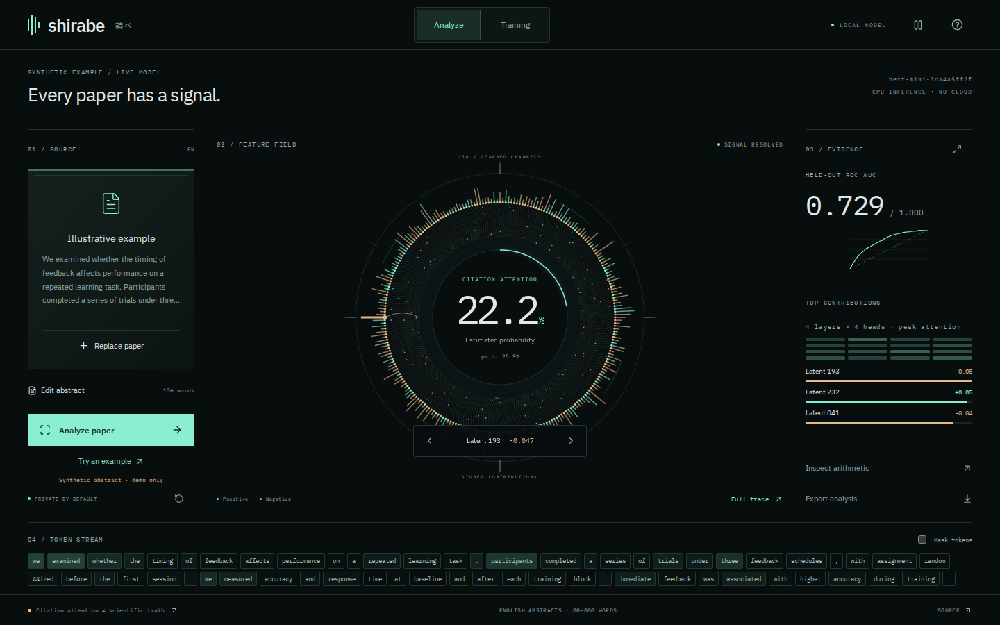

# Shirabe 調べ

A single-screen, animated research instrument for testing whether an abstract’s **language and content** predict its later citation attention. Upload a paper or paste its abstract, inspect a real trained model, and trace the score through WordPiece attention and 256 learned head channels.

Shirabe means investigation or examination. This is an experiment, not a scientific-quality rating.



[Watch the animated instrument](docs/screenshots/instrument-demo.webm).

## Run locally

Requires Linux, Python 3.11–3.13, [uv](https://docs.astral.sh/uv/), and Node 22.12+ (or 20.19+). Linux is required by the PDF worker's resource limits. A trained model ships with the repository; no API key, GPU, or dataset download is needed to use it.

```sh
git clone https://github.com/Hone-Systems/shirabe.git
cd shirabe
make setup
make run
```

Open **http://127.0.0.1:8787** for paper analysis and **http://127.0.0.1:8787/training** for the training notebook. `Ctrl+C` stops the server. React/Vite builds the interface; FastAPI serves it and performs inference in one process.

- Paste an **English abstract of 80–800 words**, or upload PDF/TXT (10 MB maximum) with **Choose paper**. **Try an example** runs a clearly labeled synthetic abstract through the real model.
- Review extracted text, remove any remaining headers/footnotes, then analyze. PDF extraction is heuristic, reads the first three pages, and does not perform OCR. Scanned/password-protected/corrupt documents return actionable errors.
- Inspect probability, exact signed log-odds contributions, input distribution warnings, WordPiece attention, or the complete learned activation vector. Download the analysis as JSON.
- Switch to **Training** in place for the measured ROC curve, calibration, baselines and cross-field transfer. **Run details** opens the full experiment, learning/optimization history, cohorts, weights, and export.
- The radial feature field shows trained coefficients before analysis and actual signed contributions afterward. Moving particles illustrate the calculation; they are not a neural-network animation or a live training log. **Full trace** opens exact arithmetic.
- Paper editing and detailed records use keyboard-accessible dialogs. Motion has a pause control and respects reduced-motion preferences.

Papers are processed by the local server and not retained. Multipart parsing may temporarily spool an upload to disk; it is closed and deleted after extraction. Text stays in page memory across tab navigation, and is discarded on refresh. No analytics, external model calls, remote fonts, or cloud spend.

## What was learned

The deployed BERT-Mini transformer was fine-tuned on real OpenAlex abstracts collected on September 16, 2026. It estimates whether a paper meets the **75th citation percentile within its retained sampled field/year cohort**, using citation counts at collection. This target measures relative attention, not truth, replication, commercial success, or importance.

| Experiment | Result |
|---|---:|
| Retained abstracts | 11,799 |
| Training / validation / calibration / test | 5,798 / 1,945 / 1,986 / 2,070 |
| Test ROC AUC | **0.729** (bootstrap 95% CI 0.704–0.752) |
| Test average precision | 0.452 (positive prevalence 0.258) |
| Test Brier score | 0.169 |
| Previous linear model AUC | 0.697 |
| Entirely excluded-field test AUC | 0.636–0.744 |
| Discipline probe accuracy | 68.6% (majority baseline 17.7%) |
| Cloud spend | **$0** |

BERT-Mini has **11.17 million parameters, 4 encoder layers, 4 attention heads per layer and 256 hidden dimensions**. We fine-tuned all parameters from Google's pretrained checkpoint on the local GPU. CPU inference needs no cloud service. The model sees topic words as well as writing patterns; subject independence is not established. The test AUC improved over the previous linear model, but a famous paper is not guaranteed a 100% score: the output is an abstract-based probability, not its known citation rank. See the [model card](docs/MODEL_CARD.md) and [data card](docs/DATA_CARD.md).

Try [Attention Is All You Need (PDF)](https://arxiv.org/pdf/1706.03762): download it, choose the paper, review the extracted abstract, and analyze.

## Reproduce and develop

```sh
# Offline: refit the shipped linear model from the public numeric feature matrix.
# Checks source/data hashes, selected regularization, coefficients, intercept, and test metrics.
make reproduce

# Full experiment: collect/resume raw samples, then retrain every comparison.
# This requires network access to OpenAlex; current API access policies apply.
make train

# Fine-tune BERT-Mini and run cross-field checks (requires raw abstract cache).
uv run --group training python scripts/train_transformer.py
# Resume completed checkpoints after interruption: add --resume.

# Unit/API/artifact checks, production build, desktop + mobile browser tests.
make test
cd web && npx playwright install chromium && cd ..
make e2e
```

Raw responses and reconstructed abstracts are cached locally in ignored files. The repository includes numeric features, labels, bibliographic outcome records, query timestamps/hashes, JSON weights and measured results. New OpenAlex downloads can change as the index evolves; the public numeric matrix supports exact offline reproduction of the previous linear baseline. See [data provenance](data/provenance.json).

Restart the API after retraining so it loads the new model. The interface detects a report/model version mismatch. For UI development, run the API on 8787 and `npm run dev --prefix web` on 5187; Vite proxies `/api` locally.

## Repository map

```text
shirabe/features.py       fixed, auditable writing representation
shirabe/inference.py      JSON-only prediction and exact explanation
shirabe/api.py            API, bounded uploads, production UI server
shirabe/pdf_worker.py     isolated, time/memory-bounded PDF parser
scripts/fetch_data.py      seeded sampling, filtering, deduplication, provenance
scripts/train.py           training, baselines, transfer tests, measured reports
scripts/reproduce_style.py offline reproduction of the linear baseline
scripts/train_transformer.py fine-tuning, evaluation and ONNX export
shirabe/transformer.py    CPU transformer inference and head decomposition
artifacts/transformer/    deployed ONNX weights, tokenizer and measured report
data/features.npz         numeric features/labels/years/fields; no paper text
artifacts/model.json      calibrated linear weights + train statistics
artifacts/report.json     complete training/evaluation record
artifacts/predictions.jsonl audit records for every retained paper
web/                      React/TypeScript interface and browser tests
```

API: `GET /api/health`, `GET /api/report`, `GET /api/provenance`, `POST /api/predict` with `{"text":"…"}`, `POST /api/extract` with multipart `file`. Interactive schema: `/docs`. The default server binds to loopback; this is a local research app, with no account system or public upload service.

## License

Original code and linear model: [AGPL-3.0](LICENSE). The BERT-Mini derivative weights and tokenizer retain the upstream Apache-2.0 license and notices in `artifacts/transformer/`. PyMuPDF uses the AGPL open-source license; other dependencies and fonts retain their own licenses. OpenAlex metadata is provided under CC0. Source paper/abstract copyrights are not relicensed by this project; raw paper text and downloaded PDFs are intentionally excluded from the repository. See [third-party notices](docs/THIRD_PARTY.md).
