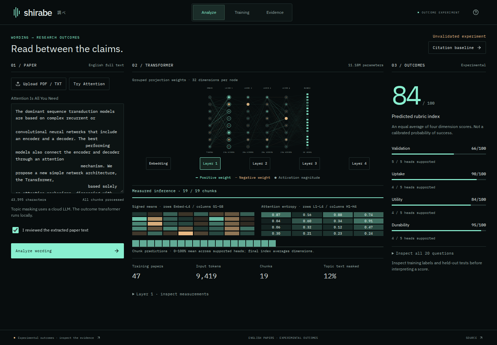
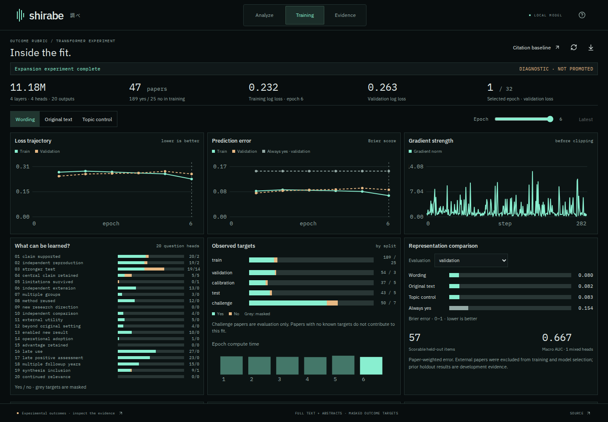
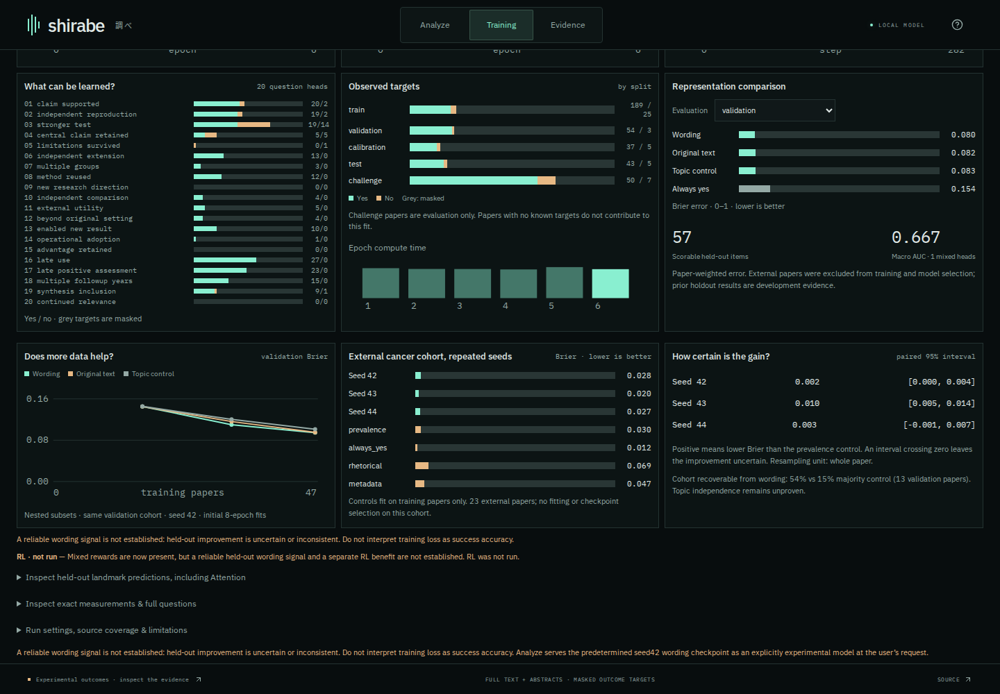
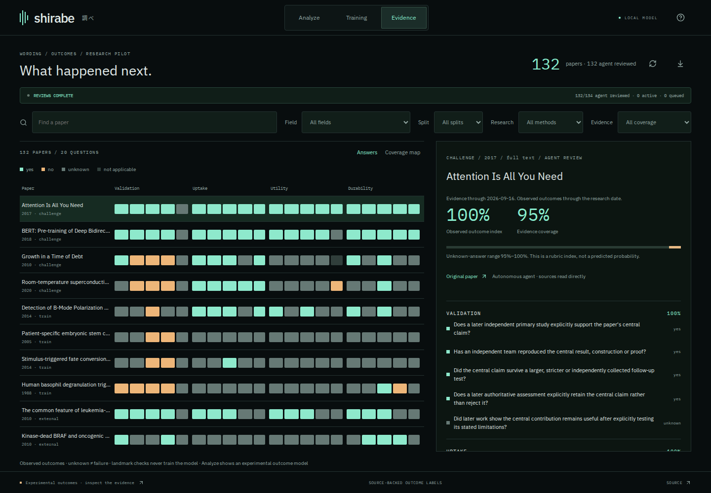

# Shirabe 調べ

**Explore the connection between scientific writing and what happens after publication.**

Upload a paper, watch a tiny transformer process its wording, and inspect the research evidence behind its training labels. Shirabe brings paper analysis, model diagnostics, and source-backed outcome research into one workspace.

> Research prototype: the model has not demonstrated useful success/failure discrimination. Its score is an experimental rubric index, not a probability of success.

## Analyze a paper

Upload an English PDF or TXT, review the extracted text, and watch real chunk progress, network activations, attention summaries, and predictions. Inspect four outcome dimensions: **validation, uptake, utility, and durability**.



## See what the model learned

Explore training loss, validation error, gradients, and label balance. Compare wording against original-text and topic-only models, scrub through epochs, and export the measurements.



Check whether improvements survive different seeds and independent evaluation. Baselines and uncertainty intervals stay visible alongside the model’s results.



## Follow the evidence

Explore each paper’s 20-question outcome rubric, read the supporting sources, and inspect disagreements or missing evidence. **Unknown does not mean failed.**



## Run locally

Requires Linux, Python 3.11–3.13, [uv](https://docs.astral.sh/uv/), and Node 22.12+ or 20.19+.

```sh
git clone https://github.com/Hone-Systems/shirabe.git
cd shirabe
make setup
make run
```

Open **http://127.0.0.1:8787**.

The repository includes the legacy citation model. The outcome analysis shown above also needs trained outcome weights, ML/research dependencies, and cloud credentials for topic masking; private weights and paper caches are not included. Topic masking sends paper text to a cloud model; transformer inference runs locally, and source text is privately cached. See [setup and development](docs/DEVELOPMENT.md).

## Current findings

The outcome model trains on **47 papers with 189 yes / 25 no labels**. Evaluation on **23 independent cancer-research papers** still favors an always-yes baseline over every model fit. Similar scores for different papers reflect a current limitation; the wording hypothesis remains unproven.

[Experiment and results](docs/WORDING_EXPERIMENT.md) · [Paper-grading skill](skills/shirabe-grade-paper/SKILL.md) · [Legacy model card](docs/MODEL_CARD.md) · [Development](docs/DEVELOPMENT.md)

[AGPL-3.0](LICENSE). Model, dependency, and source-data terms: [third-party notices](docs/THIRD_PARTY.md).
