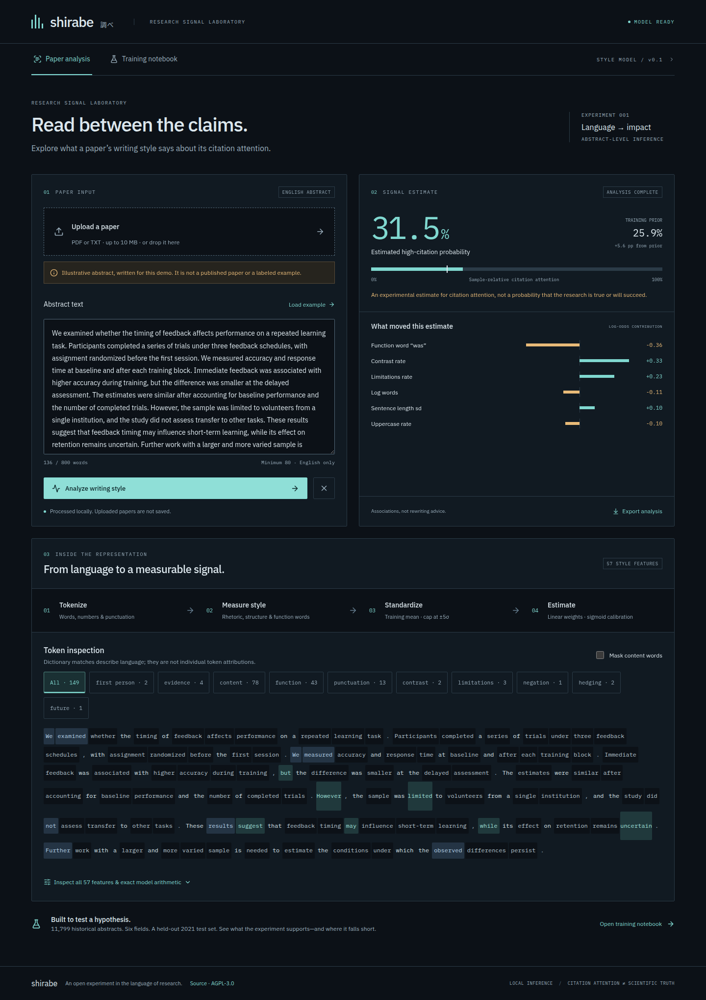

# Shirabe 調べ

An open research instrument for testing whether **how a paper is written** predicts its later citation attention. Upload a paper or paste its abstract, inspect a real trained model, and trace the score through token categories and all 57 writing features.

Shirabe means investigation or examination. This is an experiment, not a scientific-quality rating.



## Run locally

Requires Linux, Python 3.11–3.13, [uv](https://docs.astral.sh/uv/), and Node 22.12+ (or 20.19+). Linux is required by the PDF worker's resource limits. A trained model ships with the repository; no API key, GPU, or dataset download is needed to use it.

```sh
git clone https://github.com/Hone-Systems/shirabe.git
cd shirabe
make setup
make run
```

Open **http://127.0.0.1:8787** for paper analysis and **http://127.0.0.1:8787/training** for the training notebook. `Ctrl+C` stops the server. React/Vite builds the interface; FastAPI serves it and performs inference in one process.

- Paste an **English abstract of 80–800 words**, or upload PDF/TXT (10 MB maximum).
- Review extracted text, remove any remaining headers/footnotes, then analyze. PDF extraction is heuristic, reads the first three pages, and does not perform OCR. Scanned/password-protected/corrupt documents return actionable errors.
- Inspect probability, exact signed log-odds contributions, input distribution warnings, token categories, or the complete feature vector. Download the analysis as JSON.
- The training page shows measured metrics, ROC/calibration, learning/convergence curves, baselines, cross-field transfer, cohort definitions, weights, source manifest, and report export.

Papers are processed by the local server and not retained. Multipart parsing may temporarily spool an upload to disk; it is closed and deleted after extraction. Text stays in page memory across tab navigation, and is discarded on refresh. No analytics, external model calls, remote fonts, or cloud spend.

## What was learned

The fixed linear style model was trained on real OpenAlex abstracts collected on September 16, 2026. It estimates whether a paper meets the **75th citation percentile within its retained sampled field/year cohort**, using citation counts at collection. This target measures relative attention, not truth, replication, commercial success, or importance.

| Experiment | Result |
|---|---:|
| Retained abstracts | 11,799 |
| Training / validation / calibration / test | 5,798 / 1,945 / 1,986 / 2,070 |
| Test ROC AUC | **0.697** (bootstrap 95% CI 0.674–0.723) |
| Test average precision | 0.431 (positive prevalence 0.258) |
| Test Brier score | 0.175 |
| Entirely excluded-field test AUC | 0.633–0.738 |
| Separate discipline classifier accuracy | 48.0% (majority baseline 17.7%) |
| Cloud spend | **$0** |

There is useful retrospective discrimination. **Subject independence is not established.** The same features reveal discipline, citations have major confounds, and the model has not been tested on future scientific success. The UI exposes stronger and weaker baselines without hiding them. A boosted-tree style comparison scores higher than the shipped linear model; the linear architecture was chosen in advance for exact explanations.

The original intuition was that understated papers might fare better. The model does not assume that. Published research has also found [promotional language associated with greater citation attention](https://www.nature.com/articles/s44271-025-00293-8). Our dictionary is a transparent hand-authored measurement instrument, not that study's validated detector. See the [model card](docs/MODEL_CARD.md) and [data card](docs/DATA_CARD.md).

## Reproduce and develop

```sh
# Offline: refit the shipped linear model from the public numeric feature matrix.
# Checks source/data hashes, selected regularization, coefficients, intercept, and test metrics.
make reproduce

# Full experiment: collect/resume raw samples, then retrain every comparison.
# This requires network access to OpenAlex; current API access policies apply.
make train

# Unit/API/artifact checks, production build, desktop + mobile browser tests.
make test
cd web && npx playwright install chromium && cd ..
make e2e
```

Raw responses and reconstructed abstracts are cached locally in ignored files. The repository includes numeric features, labels, bibliographic outcome records, query timestamps/hashes, JSON weights and measured results. New OpenAlex downloads can change as the index evolves; the public numeric matrix supports exact offline reproduction of the deployed model. See [data provenance](data/provenance.json).

Restart the API after retraining so it loads the new model. The interface detects a report/model version mismatch. For UI development, run the API on 8787 and `npm run dev --prefix web` on 5187; Vite proxies `/api` locally.

## Repository map

```text
shirabe/features.py       fixed, auditable writing representation
shirabe/inference.py      JSON-only prediction and exact explanation
shirabe/api.py            API, bounded uploads, production UI server
shirabe/pdf_worker.py     isolated, time/memory-bounded PDF parser
scripts/fetch_data.py      seeded sampling, filtering, deduplication, provenance
scripts/train.py           training, baselines, transfer tests, measured reports
scripts/reproduce_style.py offline reproduction of the shipped model
data/features.npz         numeric features/labels/years/fields; no paper text
artifacts/model.json      calibrated linear weights + train statistics
artifacts/report.json     complete training/evaluation record
artifacts/predictions.jsonl audit records for every retained paper
web/                      React/TypeScript interface and browser tests
```

API: `GET /api/health`, `GET /api/report`, `GET /api/provenance`, `POST /api/predict` with `{"text":"…"}`, `POST /api/extract` with multipart `file`. Interactive schema: `/docs`. The default server binds to loopback; this is a local research app, with no account system or public upload service.

## License

Original code and model artifacts: [AGPL-3.0](LICENSE). PyMuPDF uses the AGPL open-source license; other dependencies and fonts retain their own licenses. OpenAlex metadata is provided under CC0. Source paper/abstract copyrights are not relicensed by this project; raw paper text and downloaded PDFs are intentionally excluded from the repository. See [third-party notices](docs/THIRD_PARTY.md).
